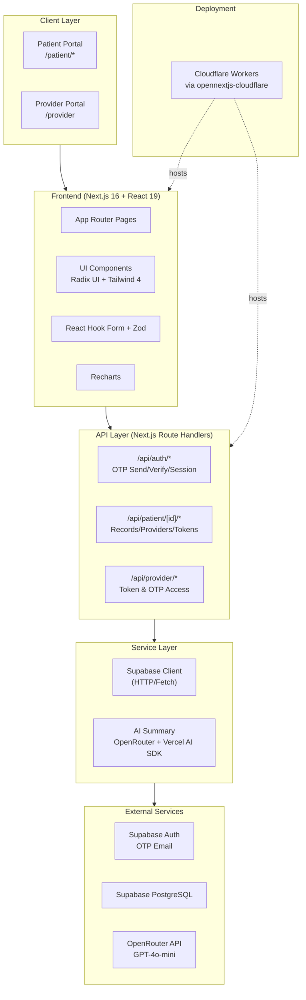
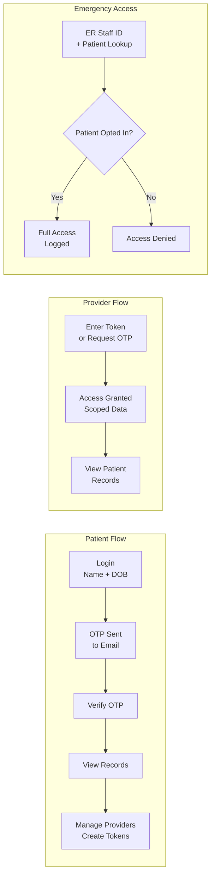
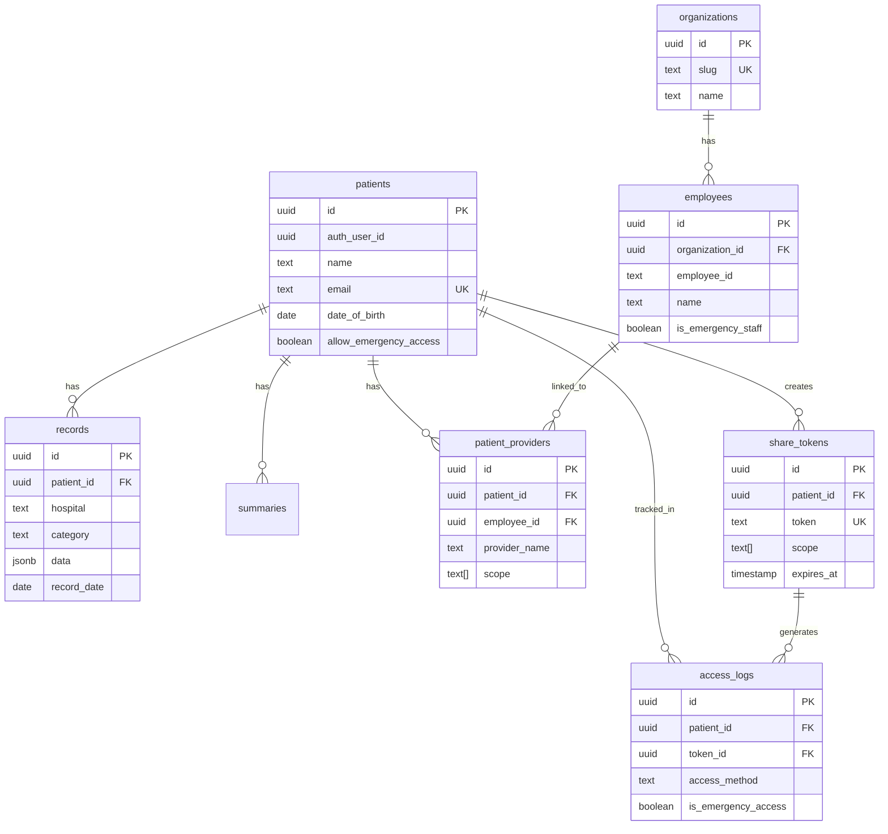

# Evexia Architecture

## Tech Stack Overview

## Data Flow

## Database Schema

## Technology Stack

| Layer | Technology |
|-------|------------|
| Runtime | Bun |
| Framework | Next.js 16 (App Router) |
| UI | React 19, Radix UI, Tailwind CSS 4 |
| Forms | React Hook Form + Zod |
| Charts | Recharts |
| Database | PostgreSQL (Supabase) |
| ORM | Drizzle (schema) + Supabase Client (queries) |
| Auth | Supabase Auth (OTP) |
| AI | OpenRouter + Vercel AI SDK |
| Deployment | Cloudflare Workers |
| Tooling | TypeScript, Biome, Knip |

## Key Design Decisions

1. **Dual Database Layer**: Drizzle for schema/migrations, Supabase HTTP client for runtime queries (Cloudflare Workers can't use TCP sockets)

2. **OTP-Only Auth**: No passwords - patients authenticate via email OTP for simplicity and security

3. **Scoped Access**: Providers only see data categories (vitals, labs, meds, encounters) explicitly granted by patient

4. **Emergency Override**: ER staff can bypass normal auth for opted-in patients, with full audit logging
